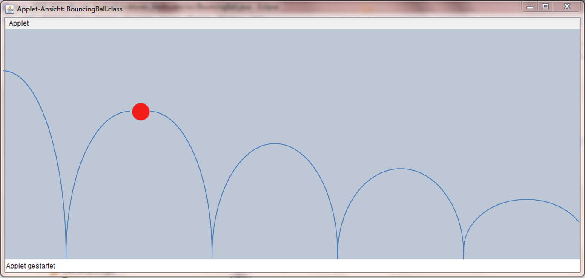
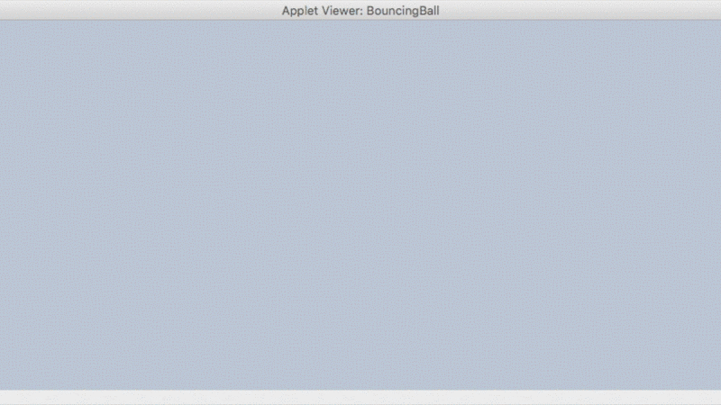

# U13 | Ball mit Physik

Erstellen Sie eine `GraphicsApp`, die einen Ball von links nach rechts
über die Zeichenfläche springen lässt:

| Der springende Ball |
|:----:|
|  |

Der Ball startet in der linken oberen Ecke, fällt dann zu Boden und
prallt wieder ab, solange er nicht den Bildschirm verlassen hat.

Auf den Ball wirken zwei Einflussfaktoren:

-   Die Schwerkraft *drückt* von oben auf den Ball und erhöht dessen
    Geschwindigkeit beim Herunterfallen in jedem Animationsschritt um
    einen konstanten Wert (z.B. 0.15). Beim Aufsteigen wird die
    Geschwindgkeit des Balles analog reduziert, bis der Ball bei der
    Geschwindgkeit '0' den Scheitelpunkt erreicht hat.

-   Bei jedem Aufprall gibt der Ball einen Teil seiner Energie ab. Legen
    Sie eine Konstante an, die angibt, wieviel Energie (= vertikale
    Geschwindigkeit) der Ball nach dem Aufprall auf den Boden noch
    behält (z.B. 0.9).

Die horizontale Geschwindigkeit des Balls ist während des gesamten
Programms konstant. Speichern Sie den Ball und seine Geschwindigkeit
(d.h. Positionsveränderung bei jedem Animationsschritt) in geeigneten
Instanzvariablen ab. Bei jedem Durchlauf von draw() sollte Ihr Programm
den Ball auf seine neue Position setzen und anschließend überprüfen, ob
der Ball auf den Boden geprallt ist. Wenn der Ball auf den Boden
getroffen ist, dann verändern Sie seine Geschwindigkeit.

**Achtung:** Es kann sein, dass der Ball ein gutes Stück unterhalb des
Bodens gesprungen ist, wenn Sie eine Kollision bemerken. Wenn dies der
Fall ist, müssen Sie ihn nach der Kollision wieder über den Boden
hieven. Dies können Sie mit dem folgenden Code erreichen:

`ball.setYPos(CANVAS_HEIGHT - ball.getRadius());`

| Der Ball in Bewegung |
|:-----:|
|  |
